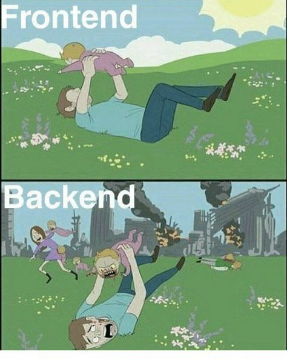
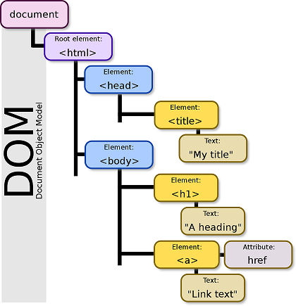
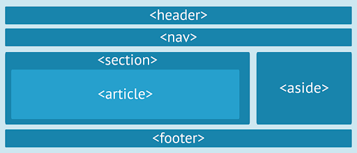

## FrontEnd
- Es la capa de presentación de la página web
- Se conforma por HTML, CSS y Javascript

<!--s-->

## FrontEnd
- 

<!--s-->

## HTML
- Hyper Text Markup Language
- Definido y mantenido por la W3C
- Versión actual 5.2
<!--v-->

## DOM

<!--s-->

## HTML - Etiquetas
* Las etiquetas HTML representan un objeto visual del DOM
* Los atributos definen las propiedades de la etiqueta
  
`<input type="text" id="input" />`
<!--v-->

## HTML - Etiquetas Principales
* Html - Contenedor principal
* Head - Encabezados
* Body - Estructura de la página
<!--v-->

## HTML - Html
Contiene el DocType (Tipo de documento)
- Versión actual: `<!DOCTYPE html>`
- Version Html4: `<!DOCTYPE HTML PUBLIC "-//W3C//DTD HTML 4.01 Transitional//EN" "http://www.w3.org/TR/html4/loose.dtd">`
- Version XHTML: `<!DOCTYPE html PUBLIC "-//W3C//DTD XHTML 1.1//EN" "http://www.w3.org/TR/xhtml11/DTD/xhtml11.dtd">`
<!--v-->

## HTML - Head
Contiene los meta tags (SEO), titulo e inclusiones de librerias CSS y JS
- `<meta name=”Description” content=”Un Noob Programa” />`
- `<meta http-equiv=”Content-Language” content=”es”/>`
- `<meta name=”distribution” content=”global”/>`
- `<meta name="Robots" content="all"/>`
<!--v-->

## HTML - Body
Contiene el contenido visible de la página

`<body 
    background="URL" 
    text="#FF4400" 
    bgcolor="#FF0000"
    leftmargin=”10px” 
    topmargin=”10px” 
    rightmargin=”10px” 
    bottommargin=”10px”
    link= “#FF0000” alink= “blue” vlink= “black”></body>`
<!--s-->

## HTML - Comentarios
Para crear un comentario en el código, usamos

`<!--Esto es un comentario-->`
<!--s-->

## HTML - Estructura
Estructura HMTL5 para armar la página (Semantic Html)

<!--v-->

