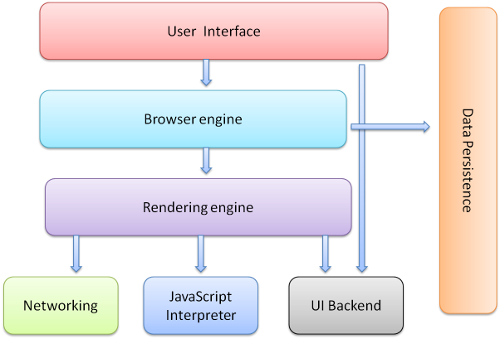
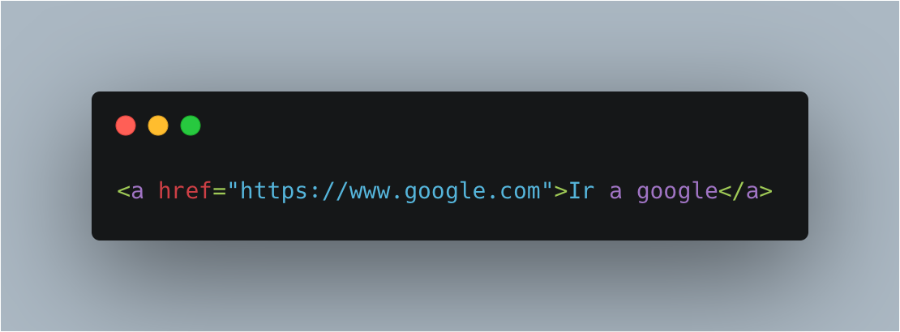

## Que es la programación?

Proceso utilizado para idear y ordenar las acciones necesarias para realizar un proyecto

<!--s-->

## Caracteristicas de la programación?

* Basada en algoritmos (Serie de pasos lógicos para ejecutar una acción)
* Es el lenguaje con el cual podemos dar ordenes a una maquina

<!--s-->

## Lenguajes de programación?

### Tipos
* Lenguajes de Alto nivel (C#, Java, Javascript, Python)
* Lenguajes de Bajo nivel (Assembler, Binario)

<!--v-->

## Lenguajes de programación?

### Categorías
* Compilados (C#, C++, Lisp)
* Interpretados (Javascript, Java)
* Combinados (Python, Ruby, Perl) (JITs)

<!--v-->

## Lenguajes de programación?

### Características

* Fuertemente Tipados (C++, Java, C#, Rust, Typescript)
* No tipados o débilmente tipados (Python, Javascript, Lisp, Perl)

<!--s-->

## Como funciona Internet?

* Redes interconectadas (estándares abiertos)
* Todos y nadie somos responsables
* Lenguaje Común: TCP/IP (protocolo)

<!--v-->

## Como funciona Internet?

* Cada computador tiene una IP (identificación única)
* ISP (Proveedores de Internet) nos dan acceso a la red publica

<!--v-->

## Como funciona Internet?

<!--s-->

## Como funciona el Navegador?

### Función Principal
Soliticar al servidor los recursos web que elija el usuario
y mostrarlos en una ventana.
* Recurso: Documento HTML, PDF, Imagen, Video, etc.

<!--v-->

## Como funciona el Navegador?

### Como solicita recursos?
A través de una URI (uniform resource identifier) o sea, la dirección del sitio
web al que quiere acceder.

<!--v-->

## Como funciona el Navegador?

### Como interpreta los archivos solicitados?
A través de HTML, CSS. Estandares regulados por la [W3C](https://www.w3.org/).

<!--v-->

## Como funciona el Navegador - Componentes

<!--v-->

## Como funciona el Navegador - Tipos y motores de renderizado
* Netscape (Ya no existe pero fue el mas importante de su tiempo)
* Chrome (Webkit), Firefox (Gecko), Safari (Webkit), Opera (blink), Edge(Webkit), Explorer (trident) (los mas conocidos)
* Tor (Parcialmente usados para cosas especiales como acceso a la darkweb)

<!--v-->

## Como funciona el Navegador - Renderización

<!--v-->

## Como funciona el Navegador - Renderización con WebKit (Chrome)

<!--v-->

## Como funciona el Navegador - Renderización con Gecko (Firefox)

<!--s-->

## Lenguajes para la Web - FrontEnd
* Javascript
* Html (Lenguaje de marcas de hipertexto)
* CSS (Hojas de estilos en cascada)

<!--s-->

## HTML
* Html (Lenguaje de marcas de hipertexto) (Mejorado en su versión XHTML)
* Creado en 1989 para compartir documentos científicos
* Solo especifica en que posición va el contenido de la página por medio del DOM (Document Object Model)
* Funciona por medio de etiquetas <></>

<!--v-->
## HTML - Etiquetas
* Html -> Doctype
* Body -> div, h1...h6, p, table, img, ul, u, i, strong, em, article, aside
* Head -> title, meta
* [Etiquetas Html5](https://brandominus.com/blog/creatividad/todas-etiquetas-html5/)
<!--v-->

## HTML - Etiquetas
* Las etiquetas se componen de atributos, donde definimos los valores

<!--v-->

## HTML - Reglas XHTML
* Siempre van en minuscula
* Siempre deben cerrarse (salvo algunas excepciones)
* Todos los atributos deben tener un valor entre comillas
* Los elementos deben estar correctamente anidados
<!--v-->
